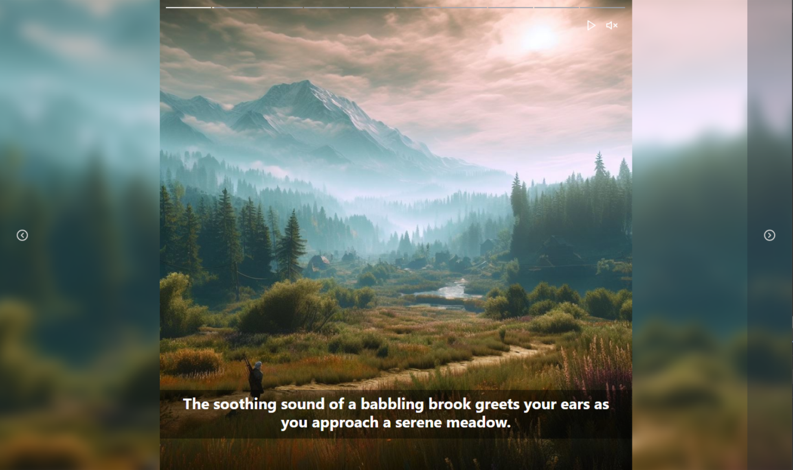
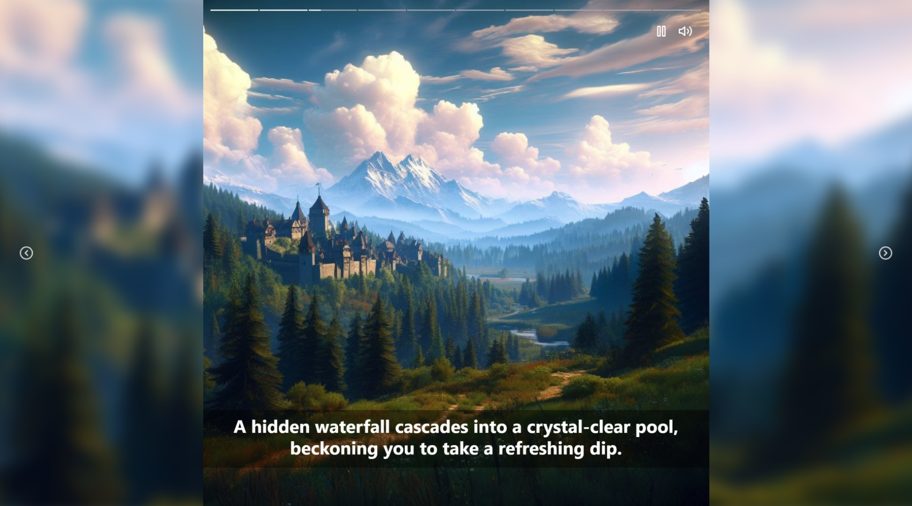

# Opera player

This is solution to Opera frontend challenge.

You can check the live demo (frontend only) deployment of this project [here](https://rafalbodanka.github.io/opera-player/).

## Table of Contents

- [Installation](#installation)
- [Usage](#usage)
- [Credits](#credits)

## Installation

This app installs both backend and frontend dependencies and launches with one command using start.js file in root folder.

1. Open a new terminal and navigate to the root folder.

2. Start the app by running the following command:

   ```bash
   node start.js
   ```

You should be able to access the app in your web browser at http://localhost:3000.

## Usage

### Backend

The backend is an Express.js app that serves image and audio data with server.js.

It provides endpoints for fetching particular images and audio, as well as a '/data' endpoint that returns data.json in the following format:

```json
[
   {
      id: 1,
      text: 'This is slide 1 text',
      imageURL: 'url_to_image_1',
      audioURL: 'url_to_audio_1'
   },
   ...
];
```

Images and audio are stored simply in the 'media' folder indexed with numbers 0-9 to make them possible to be fetched according to the current slide index.

### Frontend

`App` uses Router to navigate invalid routes and `Invalid` component redirects to the first slide.

`Main` fetches the slideData and based on paramId `/:slideId` inserts actual and n - 1, n + 1 slides into imageUrls and audioUrls arrays. Images and sounds are fetched on demand then, not all at once.

Arrays imageUrls and audioUrls are initially filled with empty strings '' depending on the length of the slideData. When the slideId changes, the imageUrls and audioUrls are set in the correct slots in the arrays to make the `Slider` component work correctly.

`Slider` is the visual part of the application. `Nav`, based on img width and top offset, displays InstaStory-like navigator with progress bar. Current bar painting is based on currentTimestamp and audioLength ratio. When the audio ends, slider goes to the next slide and paramId is updated accordingly. With storing slideId in paramId you can start from a particular slide. If paramId is longer that slideData or NaN, the user is redirected to slide number 0.

`Nav` buttons handle pause/stop and mute actions and `Controls` increment/decrement the slideId.





This project utilizes most of all the following libraries, frameworks, and resources:

- [React](https://reactjs.org/): A JavaScript library for building user interfaces.
- [Tailwind CSS](https://tailwindcss.com/): A utility-first CSS framework for rapidly building custom user interfaces.
- [Microsoft Bing Image Creator](https://www.bing.com/create): AI image generator.
- [Aaron Krogh Music](https://soundcloud.com/aaron-anderson-11/sets/rpg-maker-music-loops): Free RPG Mmusic & loops.

Please refer to the documentation or official websites of these resources for more information on how they were used in this project.
